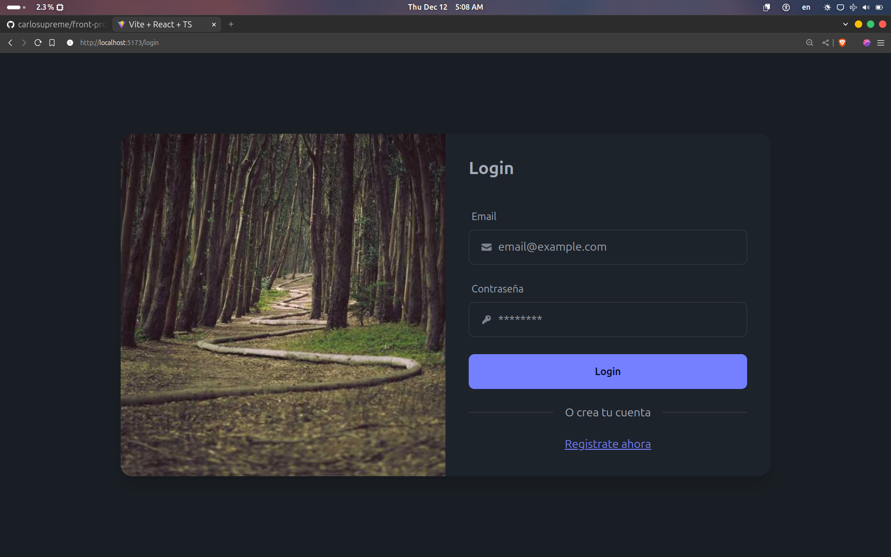
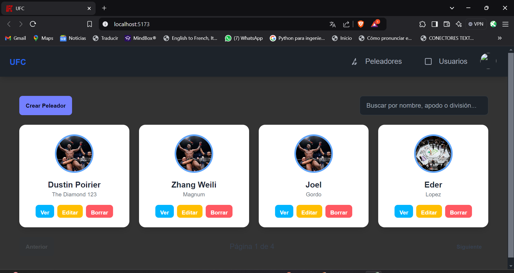
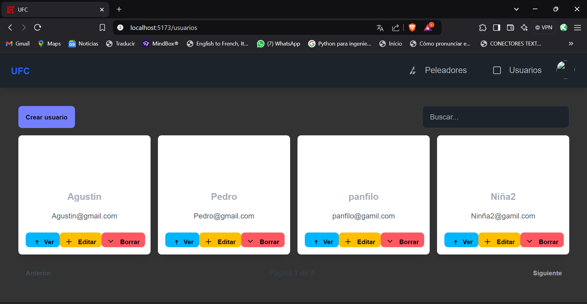
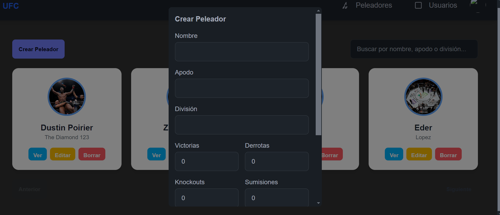
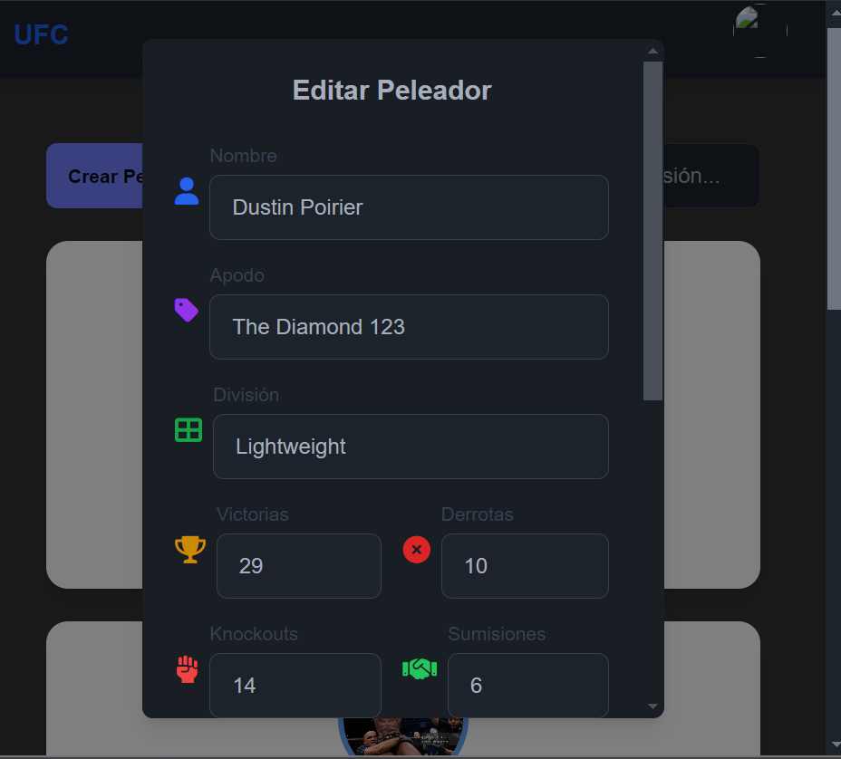
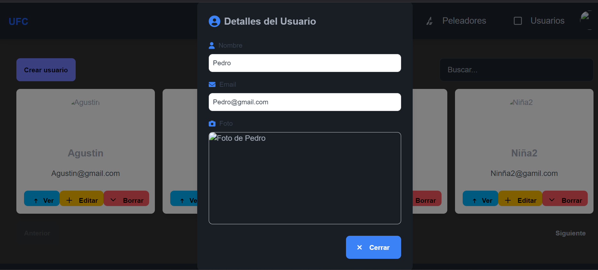
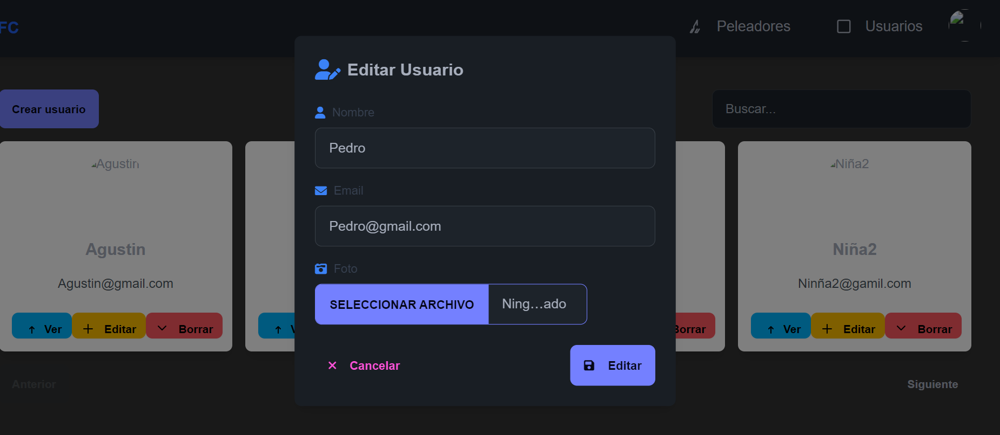
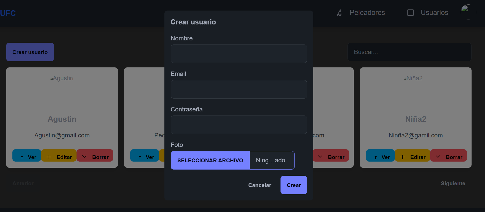

# Frontend de Gestión de Peleadores y Usuarios

Este es un proyecto **frontend** construido con **React + TypeScript** y **Vite**, diseñado para gestionar peleadores y usuarios. Incluye autenticación, vistas de peleadores/usuarios y funcionalidades **CRUD** (Crear, Leer, Actualizar, Eliminar).

## 📋 Características

1. **Login y Registro**
   - Pantallas de inicio de sesión y registro de usuarios.
2. **Gestión de Peleadores**
   - CRUD completo para peleadores.
3. **Gestión de Usuarios**
   - CRUD completo para usuarios.
4. **Componentes Modales**
   - Crear, Editar y Visualizar usuarios y peleadores.
5. **Navegación**
   - Barra de navegación y diseño con Tailwind CSS.

---

## 🚀 Tecnologías Utilizadas

- **React** + **TypeScript**
- **Vite** (Herramienta de desarrollo)
- **Tailwind CSS** (Estilización)
- **ESLint** (Linting y buenas prácticas)
- **PostCSS** (Procesador CSS)

---

## 👤 Estructura del Proyecto

```plaintext
src/
├── components/
│   ├── ui/                # Componentes de interfaz
│   │   ├── ConfirmationModal.tsx
│   │   ├── CreateFighterModal.tsx
│   │   ├── CreateUserModal.tsx
│   │   ├── EditFighterModal.tsx
│   │   ├── ViewFighterModal.tsx
│   │   └── ...           # Otros modales
│   ├── css/              # Archivos CSS personalizados
│   └── layout/
│       ├── Layout.tsx    # Estructura general de layout
│       └── Navbar.tsx    # Barra de navegación
├── pages/                # Páginas principales
│   ├── Fighters.tsx      # Página CRUD de peleadores
│   ├── Users.tsx         # Página CRUD de usuarios
│   ├── Login.tsx         # Página de Login
│   └── Register.tsx      # Página de Registro
├── assets/               # Imágenes
│   ├── crearU.png
│   ├── editarP.png
│   └── ...               # Otras imágenes
├── index.html            # Archivo principal HTML
└── vite.config.ts        # Configuración de Vite
```

---

## 🔧 Instalación y Ejecución

1. **Clona el repositorio:**
   ```bash
   git clone https://github.com/tu-usuario/tu-repositorio.git
   cd tu-repositorio
   ```

2. **Instala las dependencias:**
   ```bash
   npm install
   ```

3. **Ejecuta el servidor de desarrollo:**
   ```bash
   npm run dev
   ```

4. **Abre en tu navegador:**
   ```
   http://localhost:5173
   ```

---

## 🌟 Uso del Proyecto

### 1. **Inicio de Sesión**
   - Página: **Login**  
   - Ingresa tus credenciales para acceder al sistema.  
   - Captura de Pantalla:  
     

### 2. **Gestión de Peleadores**
   - Página: **Fighters**  
   - Funciones disponibles:  
     - **Crear**: Agregar nuevos peleadores.  
     - **Editar**: Modificar detalles de un peleador.  
     - **Eliminar**: Borrar peleadores.  
     - **Visualizar**: Ver detalles.  
   - Captura de Pantalla:  
     

### 3. **Gestión de Usuarios**
   - Página: **Users**  
   - Funciones CRUD similares a peleadores.  
   - Captura de Pantalla:  
     

---

## 🖼 Capturas de Pantalla

Aquí algunas imágenes incluidas en el proyecto:  

- **Login**  
    
- **Gestión de Peleadores**  
    
    
- **Gestión de Usuarios**  
  
    
    
---

## 🛠 Configuración Adicional

### **Tailwind CSS**
El proyecto usa **Tailwind CSS** para el diseño rápido de la interfaz.  
Si deseas personalizarlo:  
1. Configuración en `tailwind.config.js`  
2. Archivos CSS en `src/components/css/`.

---

## 🤝 Contribuciones

Las contribuciones son bienvenidas. Para colaborar:

1. Haz un **fork** del repositorio.
2. Crea una nueva rama:  
   ```bash
   git checkout -b feature/nueva-funcionalidad
   ```
3. Realiza tus cambios y haz un **commit**:  
   ```bash
   git commit -m "Agrega nueva funcionalidad"
   ```
4. Envía un **Pull Request**.

---

## 📜 Licencia

Este proyecto está bajo la licencia **MIT**.

---

## 🔗 Contacto

Si tienes preguntas, no dudes en contactarme:  
**Nombre**: Eder Denilson López González  
**Correo**: [21160693@itoax.edu.mx](mailto:21160693@itoax.edu.mx)
